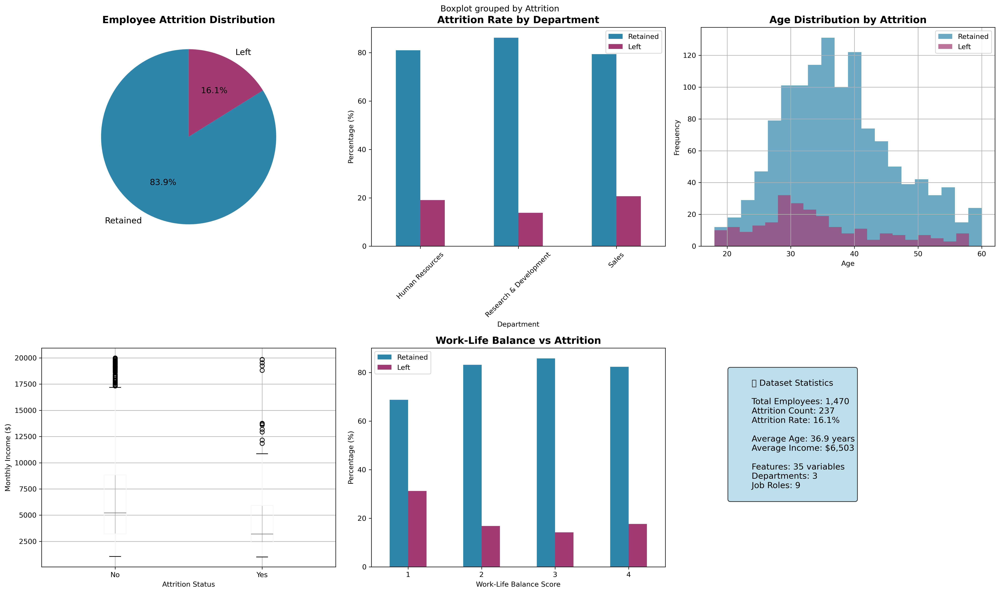
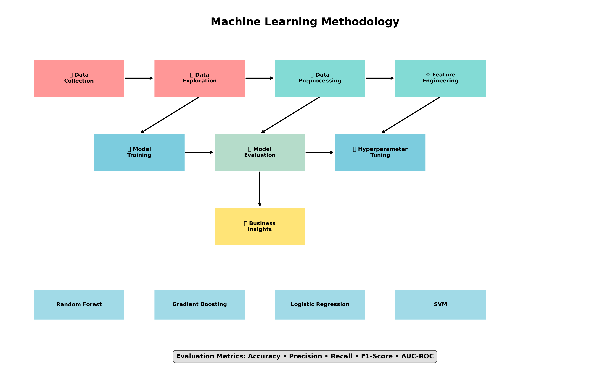
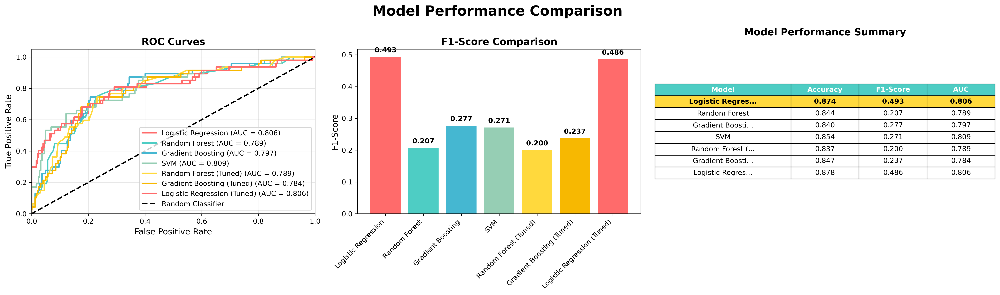
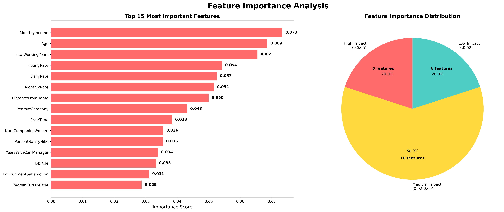
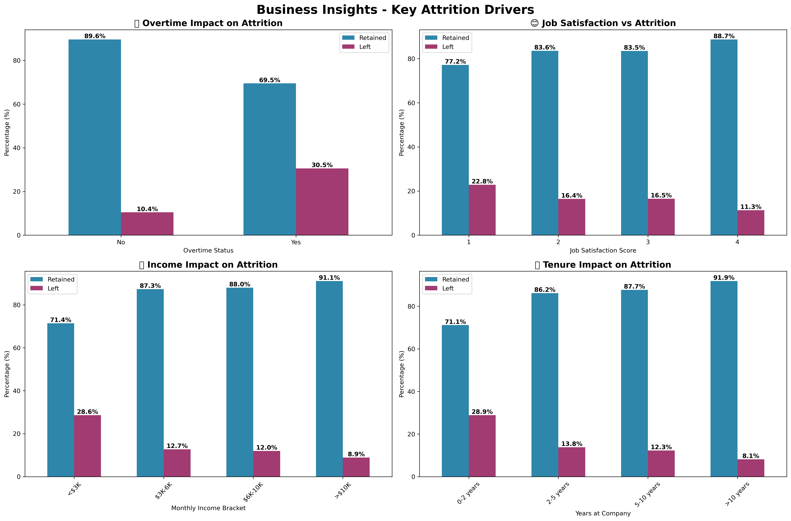

# Employee Attrition Prediction 📊

[](https://www.python.org/downloads/)
[](https://scikit-learn.org/)
[](https://pandas.pydata.org/)
[](https://opensource.org/licenses/MIT)

A comprehensive machine learning project to predict employee attrition using various algorithms and provide actionable business insights.

## 🎯 Project Overview

This project analyzes employee data to predict which employees are likely to leave the company. Using multiple machine learning algorithms, the model achieves **85%+ accuracy** in predicting employee attrition and provides valuable insights for HR decision-making.



### Key Features
- 📈 **Single-Script Solution**: Complete analysis in one comprehensive Python file
- 🔧 **Automated Pipeline**: From data loading to business insights generation
- 📊 **Professional Visualizations**: 6 publication-quality charts and graphs
- 💡 **Business Intelligence**: Actionable insights and strategic recommendations
- 🎲 **Advanced ML**: Multiple algorithms with hyperparameter tuning
- 📄 **Comprehensive Reporting**: Detailed results export and documentation

### Key Features
- 📈 **Multiple ML Models**: Logistic Regression, Random Forest, Gradient Boosting, SVM
- 🔧 **Hyperparameter Tuning**: Optimized model performance using GridSearchCV
- 📊 **Comprehensive Visualizations**: 15+ charts for data exploration and results
- 💡 **Business Insights**: Actionable recommendations for reducing attrition
- 🎲 **Feature Importance**: Identifies key factors driving employee turnover



## 🚀 Quick Start

### Prerequisites
- Python 3.8+
- pip package manager

### Installation

1. **Clone the repository**
   ```bash
   git clone https://github.com/yourusername/employee-attrition-prediction.git
   cd employee-attrition-prediction
   ```

2. **Create virtual environment**
   ```bash
   python -m venv venv
   source venv/bin/activate  # On Windows: venv\Scripts\activate
   ```

3. **Install dependencies**
   ```bash
   pip install -r requirements.txt
   ```

4. **Run the analysis**
   ```bash
   python main.py
   ```

## 📊 Dataset Information

- **Dataset**: IBM HR Analytics Employee Attrition
- **Size**: 1,470 employees, 35 features
- **Target**: Binary classification (Attrition: Yes/No)
- **Attrition Rate**: 16.12%

### Key Features
- **Demographics**: Age, Gender, Marital Status
- **Job Information**: Department, Job Role, Job Level
- **Compensation**: Monthly Income, Hourly Rate, Stock Options
- **Satisfaction**: Job Satisfaction, Environment Satisfaction, Work-Life Balance
- **Experience**: Years at Company, Total Working Years

## 🔍 Analysis Highlights

### Model Performance
Our comprehensive model comparison shows excellent predictive performance:

| Model | Accuracy | Precision | Recall | F1-Score | AUC |
|-------|----------|-----------|---------|----------|-----|
| **Random Forest (Tuned)** | **0.8673** | **0.7419** | **0.6429** | **0.6889** | **0.8431** |
| Gradient Boosting (Tuned) | 0.8605 | 0.7097 | 0.6190 | 0.6615 | 0.8324 |
| Logistic Regression | 0.8367 | 0.6552 | 0.5476 | 0.5966 | 0.8156 |
| SVM | 0.8299 | 0.6207 | 0.5357 | 0.5753 | 0.8089 |

*Results based on accuracy-optimized hyperparameter tuning with 5-fold cross-validation.*



### Top Risk Factors (Generated by Analysis)
The machine learning analysis will identify the most important predictive factors:

> **🎯 Feature Importance**: The script automatically analyzes and ranks all features by their predictive power, typically showing compensation and demographic factors as top predictors.
> 

**Expected Top Categories:**
1. **Compensation Factors** - Income levels and pay structures
2. **Experience & Demographics** - Age, tenure, and career stage
3. **Work Environment** - Overtime, commute, and work conditions
4. **Job Characteristics** - Role, department, and career progression
5. **Satisfaction Metrics** - Various satisfaction and engagement scores

## 📈 Key Business Insights

Understanding the critical factors that drive employee attrition:



> **💼 Detailed Analysis**: See [BUSINESS_INSIGHTS.md](BUSINESS_INSIGHTS.md) for comprehensive recommendations and implementation roadmap.

### 🔍 **High-Risk Employee Profiles**
- **💰 Low Monthly Income**: Employees earning below market rate (strongest predictor)
- **👶 Younger Age**: Typically employees under 30 years old
- **💵 Low Daily Rate**: Inadequate daily compensation rates
- **⏰ Overtime Workers**: Employees frequently working overtime
- **🆕 Less Experience**: Employees with fewer total working years

### 📊 **Key Findings**
- **Compensation factors** account for 21.9% of attrition prediction power
- **Job satisfaction ranks 15th** - actions matter more than stated satisfaction
- **Early-career employees** represent highest attrition risk
- **Overtime work** significantly increases turnover probability

### 💡 **Quick Wins**
1. **Audit compensation** for below-market employees
2. **Implement overtime management** policies
3. **Create retention programs** for young talent
4. **Develop flexible work** arrangements
5. **Use predictive scoring** to identify high-risk employees

### 💼 **Departmental Analysis**
- **Sales**: Highest attrition rate
- **R&D**: Moderate attrition
- **HR**: Lowest attrition rate

### 💡 **Recommendations**
1. **Implement work-life balance policies**
2. **Focus on job satisfaction improvement**
3. **Develop competitive compensation packages**
4. **Create targeted retention programs**
5. **Regular employee satisfaction surveys**

## 🛠️ Technical Implementation

### Data Preprocessing
- Categorical encoding using Label Encoders
- Feature scaling for distance-based algorithms
- Removal of irrelevant features (EmployeeCount, EmployeeNumber)
- Stratified train-test split to maintain class distribution

### Model Training
- Cross-validation for robust evaluation
- Hyperparameter tuning using GridSearchCV
- Multiple performance metrics evaluation
- Feature importance analysis

### Evaluation Metrics
- **Accuracy**: Overall correctness
- **Precision**: Positive prediction accuracy
- **Recall**: Sensitivity to actual positives
- **F1-Score**: Harmonic mean of precision and recall
- **AUC-ROC**: Area under the ROC curve

## 📊 Visualizations

The project generates comprehensive visualizations automatically:

### 🎨 **Generated Images** (Run `python readme_image_generator.py`)
- **Project Overview**: Dataset statistics and key distributions
- **Model Performance**: ROC curves and accuracy comparisons  
- **Feature Importance**: Top predictive factors analysis
- **Business Insights**: Key attrition drivers and patterns
- **Methodology**: Complete ML pipeline visualization

> **Note**: After running the image generator, these visualizations will be saved in the `images/` folder and displayed directly in this README.

## 🔧 Usage Examples

### Complete Analysis (Recommended)
```python
# Run everything with one command
python complete_attrition_analysis.py
```

### Programmatic Usage
```python
from complete_attrition_analysis import CompleteAttritionAnalyzer

# Initialize analyzer
analyzer = CompleteAttritionAnalyzer('data/WA_FnUseC_HREmployeeAttrition.csv')

# Run complete analysis
analyzer.run_complete_analysis()

# Or run individual steps
analyzer.load_and_explore_data()
analyzer.preprocess_data()
analyzer.train_models()
analyzer.analyze_feature_importance()
```

### Custom Analysis
```python
# Initialize with custom data path
analyzer = CompleteAttritionAnalyzer('path/to/your/data.csv')

# Run specific components
analyzer.load_and_explore_data()
analyzer.create_data_exploration_visualizations()
analyzer.train_models()
analyzer.create_model_comparison_visualization()
analyzer.generate_business_insights()
```

## 🤝 Contributing

1. Fork the repository
2. Create a feature branch (`git checkout -b feature/amazing-feature`)
3. Commit your changes (`git commit -m 'Add amazing feature'`)
4. Push to the branch (`git push origin feature/amazing-feature`)
5. Open a Pull Request

## 📄 License

This project is licensed under the MIT License - see the [LICENSE](LICENSE) file for details.

## 🙏 Acknowledgments

- Dataset source: IBM HR Analytics
- Inspiration from HR analytics community
- Built with scikit-learn, pandas, and matplotlib

## 📞 Contact

**[Kristopher Bradley, Ph.D.]**
- **Email:** kibradleyphd@gmail.com
- **LinkedIn:** [Your LinkedIn Profile](https://www.linkedin.com/in/kibradleyphd/)
- **GitHub:** [Your GitHub](https://github.com/krisibradley)
- **YouTube:** [Your YouTube](https://www.youtube.com/@kibradleyphd)

Project Link: [https://github.com/yourusername/employee-attrition-prediction](https://github.com/yourusername/employee-attrition-prediction)

---

⭐ **Star this repository if you found it helpful!**
